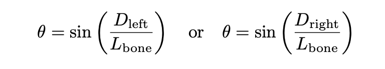
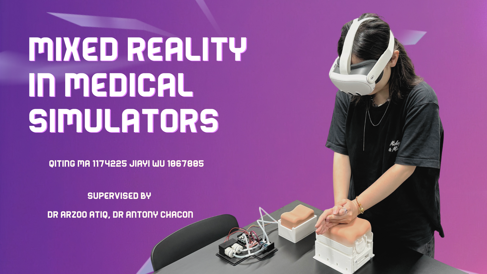
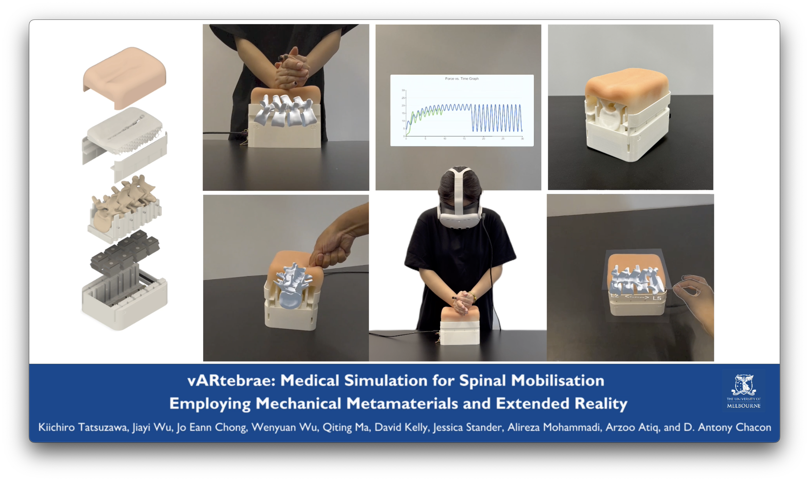

# Exploring Mixed Reality for Enhanced Visual Feedback in Medical Simulators
**INFO90009 User Experience Design, The University of Melbourne**

📜 **CHI 2025 Late Break Work (LBW)**

🏆 [**Endeavour Exhibition 2024**](https://endeavour.unimelb.edu.au/experience-endeavour/past/2024-endeavour-exhibition-semester-2), The University of Melbourne

## Table of contents
- [Overview](#overview)
- [Implementation](#implementation)
    - [Meta Quest 3 Setup](#meta-quest-3-setup)
    - [Bluetooth Connection](#bluetooth-connection)
    - [Calibration](#calibration)
    - [Displacement and Rotation](#displacement-and-rotation)
    - [Color Change](#color-change)
- [Demo](#demo)
- [CHI 2025 LBW](#chi-2025-lbw)
    - [Video Presentation](#video-presentation)
- [Full Report](INFO90009_Visual_Report.pdf)

## Overview
Back pain is a widespread health issue, with chronic cases significantly impacting daily activities and affecting a substantial portion of the population. Physiotherapists play a crucial role to alleviate this ailment. However their education is not always optimal. Traditional physiotherapy education is constrained by inability to mimic the conditions of real patients and limited visual feedback for spinal mobilisation. To enhance training, we developed a mixed reality (MR) application intended to work with physical simulator devices, SpinalLog and vARtebra, using Unity engine and Meta Quest 3. This application offers real-time visual and haptic feedback of bone activities on applied force, enabling realistic spinal mobilisation for physiotherapy training. A user evaluation with physiotherapy experts and students provided positive and useful feedback, validating the effectiveness of this application and highlighting the potential to improve the functionality accuracy and user experience of the system. Future work will focus on streamlining calibration, enhancing sensory feedback, expanding functionality for more comprehensive and immersive training experience, and validate short and long term learning effects.

## Implementation
### Meta Quest 3 Setup
...

### Bluetooth Connection
To ensure the application runs smoothly, one key prerequisite is the successful connection of the Bluetooth. Since the application require real time communication with the physical device, without a stable connection, almost all features of the application will be unavailable. We utilised [Arduino Bluetooth plugin](https://assetstore.unity.com/packages/tools/input-management/arduino-bluetooth-plugin-98960) from Unity Asset store to establish the Bluetooth connection, as well as read and send data between devices.

**ESP32 and Unity**: To receive data from the esp32 and process it in Unity, the first step is to import the ArduinoBluetoothAPI, Once imported, we can scan the nearby devices by name using [_BluetoothHelper.GetInstance(”Device Name”)_](Quest3/Assets/Scripts/SpinalLog/SpinalLogBlueToothManager.cs), after identifying the correct device, we use [_BTHelper.Connect()_](Quest3/Assets/Scripts/SpinalLog/SpinalLogBlueToothManager.cs) to establish a connection with the esp32. Once the device is connected, we start continuously read data from the esp32 to achieve real time data processing.

### Calibration
Unity’s Building Blocks extension was integrated to facilitate hand interactions within the application. The [HandGrabAPI](https://developers.meta.com/horizon/documentation/unity/unity-isdk-hand-grab-interaction/) was used to enable natural hand movements, allowing users to grab the virtual objects. Through the API, the user’s hand movements and gestures are accurately mapped to a virtual hand model, ensuring that all actions are replicated and synchronised in real time.

To spawn the virtual bone, user are required to perform a pinch gesture using their right thumb and index finger. this is implemented using the method [_OVRInput.GetDown(OVRInput.Button.One)_](Quest3/Assets/Scripts/CalibrationTest.cs), where the pinch gesture is equivalent to pressing Button one on the controller. The local position of the virtual hand is then captured and recorded using [_OVRInput.GetLocalControllerPosition(OVRInput.Controller.RTouch)_](Quest3/Assets/Scripts/CalibrationTest.cs). Subsequently, the position of the virtual bone is set to align with the virtual hand, thus achieving the virtual bone spawns at the position of the right hand when a pinch is made. Since the hand grab building block is added to the virtual bone component, users can grab the cube with thumb and index finger just like the way they generate it. release the finger will end the grab. To improve the accuracy of the calibration, it is crucial to ensure that the virtual bone remains parallel to the horizontal plane at all times. this was achieved using _forward.y = 0_ so that y axis will not change.

when the virtual bone has been moved and placed in the desired location, user can lock the position of the bone in the menu to fix its position. This is achieved by finding the hand grab component with [_cube.transform.Find(”[BuildingBlock] HandGrab”)_](Quest3/Assets/Scripts/CalibrationTest.cs) and then disabling it using [_cube.GetComponent¡Renderer¿().enabled = false_](Quest3/Assets/Scripts/CalibrationTest.cs).

### Displacement and Rotation
The ESP32 micro-controller on the SpinalLog device transmits a string containing eight data points, representing depth measurements from L2 left sensor to L5 right sensor. Each string is received by Unity and converted into float values using the [_ToFloatArray(String message)_]((Quest3/Assets/Scripts/SpinalLog/SpinalLogBlueToothManager.cs)) function.
Each bone in the system is managed by a dedicated BoneController class, which processes both the left (Dleft) and right (Dright) distance data. These distances represent the measured gap between the top magnet and the corresponding magnetic sensor. The BoneController class then uses this data to update the position and rotation of the bone.

**a. Up-Down Movement**

The [_UpDownMove()_](Quest3/Assets/Scripts/SpinalLog/BoneController.cs) function firstly calculates the average depth between the Dleft and Dright of each bone. Then, it will compare the current average depth with the initial depth, and update the local position of each bone in the bone group set.

**b. Transverse Rotation**

The [_TransverseRotationDegree()_](Quest3/Assets/Scripts/SpinalLog/BoneController.cs) function computes the transverse rotation of a single bone based on the difference in depth between the left and right side of the bone. The function uses the bone’s length _Lbone_ as a scaling factor:
- If only one side is pressed down (i.e. _Dleft_ = 0 or _Dright_ = 0), the rotation is based on the available depth:

  

- Otherwise, the rotation is computed based on the half distance:

  

Once the rotation angle is calculated, the function determines the direction of rotation based on the relative value of _Dleft_ and _Dright_:
- if Dleft > Dright, the bone will rotate in the positive direction: _θ_,
- if Dright > Dleft, the bone will rotate in the opposite direction: _−θ_x.

  

**b. Sagittal Rotation**

The process of calculating sagittal rotation begins with identifying the focus bone in each Unity frame, and the focus bone does not have sagittal rotation. [_FindFocusBoneDepth()_ ](Quest3/Assets/Scripts/SpinalLog/BoneGroupController.cs) function is used to identify the bone with deepest distance by comparing the depths of all bones in the bone group.
The next step is to calculate the rotation angle based on the relative position of the target bone to the focus bone:

  

Here, _Ddiff_ represents the depth difference between the target bone and the focus bone, while _Dgap_ is a constant used to scale the distance between the target bone and the focus bone.
The rotation direction is then determined by the position of the target bone relative to the focus bone. By comparing their IDs:
- if thisBoneID < focusBoneID, the bone will rotate in the negative direction: _−θ_,
- if thisBoneID > focusBoneID, the bone will rotate in the positive direction: _−θ_.

  

### Color Change
If the bone reaches MIN DEPTH, indicating that the force applied to the device is too much, the bone starts turning into red. To achieve the [functionality of colour transition](Quest3/Assets/Scripts/SpinalLog/BoneController.cs), the factor _t_ is calculated using _Mathf.InverseLerp_ method, which map the _currentDepth_ to a normalized range between MIN DEPTH, the depth at which colour change begins and MAX DEPTH, where the bone completely transition to red. Then, the colour of bone can be calculated and smoothly changed from white at MIN DEPTH to MAX DEPTH by using _Color.Lerp_ method.

## Demo

  

Youtube [▶️](https://youtu.be/8DzDJ09ZoG8?si=fC7pU4CaEKnl9X3m)

CHI2025 Video Presentation [🎥](#chi-2025-lbw)

## CHI 2025 LBW
Kiichiro Tatsuzawa, Jiayi Wu, Jo Eann Chong, Wenyuan Wu, Qiting Ma, David Kelly, Jessica Stander, Alireza Mohammadi, Arzoo Atiq, and D. Antony Chacon. 2025. vARtebrae: Medical Simulation for Spinal Mobilisation Employing Mechanical Metamaterials and Extended Reality. In Extended Abstracts of the CHI Conference on Human Factors in Computing Systems (CHI EA ’25), April 26-May 1, 2025, Yokohama, Japan. ACM, New York, NY, USA, 7 pages. https://doi.org/10.1145/3706599.3719996

### Video Presentation

  

Youtube [▶️](https://youtu.be/I_KJoeDg2_g?si=IhyQHanwLyXXnxF9)

### Poster
